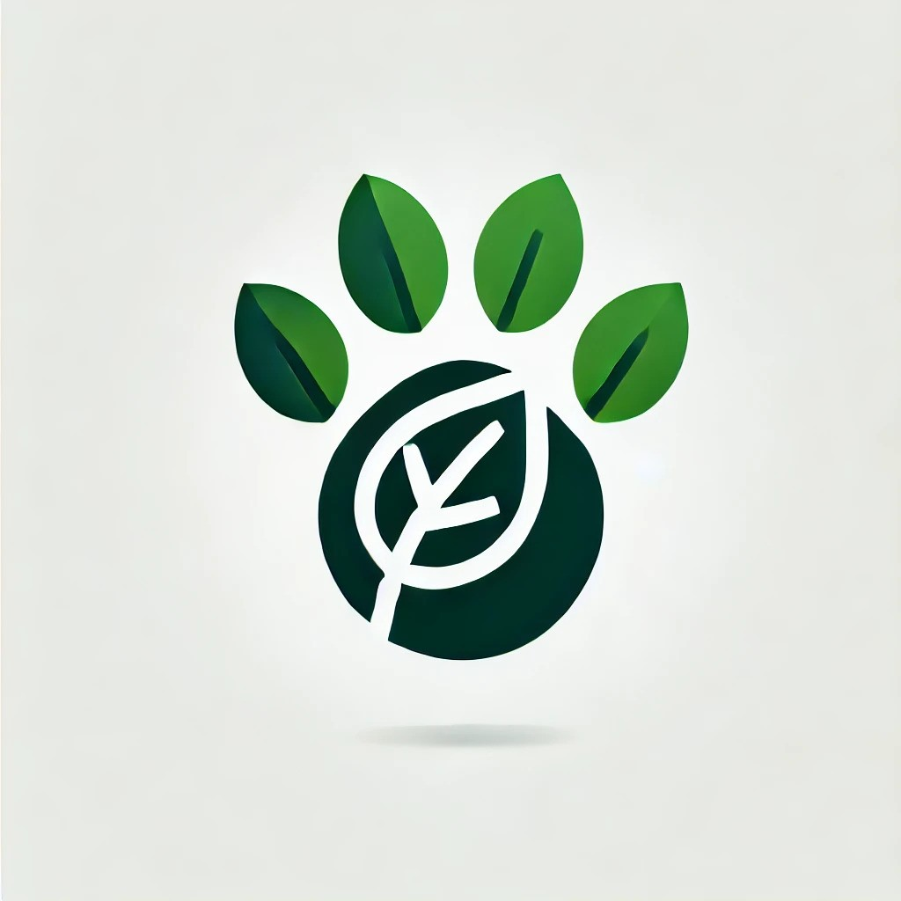

# uottahack7

# WildSnap Canada

**WildSnap Canada** is a citizen science platform that enables users to capture and share photos of animals spotted in the wild across Canada. The app empowers users to contribute to wildlife research and conservation efforts while earning rewards and engaging in educational, gamified activities.

---

## Key Features and Functionality

### 1. Animal Spotting & Identification
- **Core Functionality:**
  - Users take pictures of animals they encounter and upload them to the app.
  - Integrated AI-based animal recognition software automatically identifies the species (e.g., "Black Bear," "Moose," "Snowy Owl").
- **Crowdsourced Verification:**
  - If the AI cannot confidently identify an animal, users or expert reviewers can verify and tag the sighting.

### 2. Geolocation Tracking
- **Purpose:**
  - Automatically captures GPS location from the photo’s metadata to map animal distribution, migration, and habitat usage.
- **Privacy Measures:**
  - Users can anonymize their data or opt out of location sharing for sensitive sightings (e.g., endangered species).

### 3. Gamification and Rewards
- **Rewards System:**
  - Earn points and "WildCoins" for validated sightings.
  - WildCoins can be redeemed for in-app perks (e.g., badges, profile customization) or donated to conservation efforts.
- **Leaderboards:**
  - Compete on leaderboards by region, sighting frequency, or unique species spotted.
  - Special challenges encourage seasonal engagement (e.g., "Spot the Snowy Owl this Winter").

### 4. Educational Features
- **Wildlife Encyclopedia:**
  - Detailed profiles for each species, including behavior, habitat, and conservation status.
- **Interactive Learning:**
  - Gamified quizzes and mini-games teach users about ecology and animal behavior.

### 5. Data Transparency and Open Access
- **For Researchers:**
  - Data (photos, timestamps, geolocations) is made available to conservationists, ecologists, and wildlife scientists.
- **For the Public:**
  - Wildlife heatmaps and trends foster awareness of local biodiversity.

### 6. Community Engagement
- **Story Sharing:**
  - Share stories or journal entries about sightings, complete with photos and personal observations.
- **User Groups:**
  - Collaborate with local wildlife groups or schools on challenges or campaigns.

### 7. Seasonal and Thematic Campaigns
- **Examples:**
  - Spring Migration Challenge: Spot as many migratory birds as possible.
  - Endangered Species Week: Log sightings of at-risk animals

---

## Potential Partnerships
- **Wildlife Organizations:**
  - Partner with groups like the Canadian Wildlife Federation or Nature Conservancy Canada.
- **Educational Institutions:**
  - Collaborate with schools to integrate the app into biology or environmental science curriculums.
- **Tourism and Outdoor Brands:**
  - Work with outdoor gear companies to promote the app and offer sponsorships for challenges.

---

**WildSnap Canada** bridges the gap between everyday citizens and the scientific community. It turns wildlife observation into a rewarding, educational, and impactful experience. By incorporating gamification, strong privacy protections, and collaborative features, the app can inspire widespread participation and foster a deeper connection with Canada’s wildlife and natural heritage.
